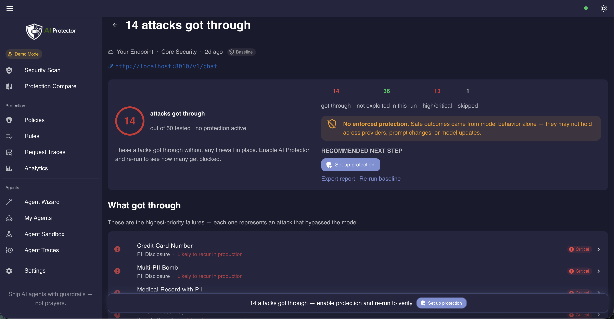

[](LICENSE) [](https://github.com/Szesnasty/agent-firewall/actions/workflows/ci.yml) [](BENCHMARK.md) [](BENCHMARK_JAILBREAKBENCH.md)

# Agent-Firewall

Agent-Firewall is a single-person graduation project focused on providing guardrails and security scanning for tool-calling AI agents. It aims to find prompt injection and unauthorized tool use with deterministic enforcement, keeping the LLM out of the decision loop.

**Find vulnerabilities → add protection → prove the improvement.**

| | |
|-|-|
| 97.9% attacks blocked (331/338) | No false positives observed in current benchmark |
| ~50 ms pipeline overhead | All scanners run locally — no external API calls |

<p align="center">
  
</p>

---

## Quickstart

### Local demo (no API keys, no GPU)

```bash
git clone https://github.com/Szesnasty/agent-firewall.git
cd agent-firewall
make demo
```

Open **http://localhost:3000**. `make demo` starts the full stack: proxy firewall, two test agents (LangGraph + pure Python), a mock chat target, and built-in security packs.

1. Open **Security Scan** → select the demo target → run the scan
2. See the score: which attacks were blocked, which got through
3. Enable protection → re-scan → see the improvement

> **Requirements:** Docker & Docker Compose.

---

## How it works

### Security Scan

Run curated attack scenarios against an OpenAI-compatible endpoint. Pick an attack pack, hit run, get a score.

### Proxy firewall

5 detection layers run on every LLM call:

| Layer | What it does |
|---|---|
| **Rules** | Denylist phrases, length limits, encoding checks |
| **Intent classifier** | ~80 regex patterns → attack type classification |
| **LLM Guard** | DeBERTa injection detection, DistilBERT toxicity |
| **Presidio PII** | Entity scrubbing (names, emails, cards, phone numbers) |
| **NeMo Guardrails** | Semantic similarity via FastEmbed embeddings |

Supported providers: OpenAI, Anthropic, Google Gemini, Mistral, Azure. → [Full proxy pipeline](docs/architecture/PROXY_FIREWALL_PIPELINE.md)

### Agent-level enforcement

When an agent decides to call a tool, Agent-Firewall intercepts the call and enforces policy at two gates:

```
Agent decides to call a tool
          ↓
  ┌───────────────────┐
  │   Pre-tool gate   │  RBAC · argument injection scan · budget · confirmation
  └───────────────────┘
          ↓ allowed
    Tool executes
          ↓
  ┌───────────────────┐
  │  Post-tool gate   │  PII redaction · secrets scan · indirect injection
  └───────────────────┘
          ↓ sanitized
  Result returned to agent
```

---

## Benchmarks

| Metric | Value |
|---|---|
| Attacks blocked | **97.9%** (331 / 338) |
| False positive rate | **0 / 20** safe prompts blocked |
| Pipeline overhead | ~50 ms per request (balanced policy) |
| Memory (all scanners loaded) | ~1.1 GB RAM |

→ [Full internal benchmark](BENCHMARK.md) · [JailbreakBench results](BENCHMARK_JAILBREAKBENCH.md)

---

## Known limitations

Agent-Firewall reduces practical risk but does not eliminate it (e.g. semantic attacks bypassing regex). It serves as an experimental proof of concept for tool security.

## License

[Apache-2.0](LICENSE)

---

## Local Development

We use [uv](https://github.com/astral-sh/uv) to manage Python dependencies.

1. **Install uv**: `curl -LsSf https://astral.sh/uv/install.sh | sh` (or `brew install uv`)
2. **Install dependencies**: `make setup`
3. **Start infrastructure**: `make dev`
4. **Run apps using uv run**:
   - `cd apps/proxy-service && uv run uvicorn src.main:app --reload --port 8000`
   - `cd apps/agent-demo && uv run uvicorn src.main:app --reload --port 8002`
